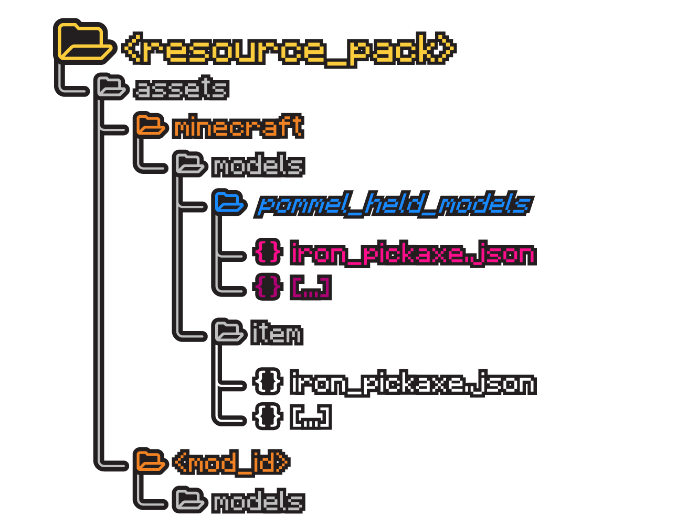

 

<h1>Pommel - Held Item Models</h1>

 

<h3><a href="https://modrinth.com/mod/pommel-held-item-models">Modrinth Page</a></h3>

 

<h2>What is Pommel?</h2>

Pommel is a Fabric mod that lets resourcepacks replace the models for the held version of items, letting you customize what your item looks in your hand. Want to make a 3d model of the mace in your hand, a fiery greatsword, or an ancient magical staff while the item still being an image sprite? With Pommel, all that can be achieved!

 

<h2>For Resource Pack Creators</h2>

Pommel replaces the held version of an item by whatever model file is under <code>assets/minecraft OR mod_id/models/pommel_held_models</code>. The model file in this folder must be named after the item it is replacing. E.g., the held model <code>iron_pickaxe.json</code> in this folder will replace the item, <code>minecraft:iron_pickaxe</code>.

The default GUI item model will still use the vanilla model file from <code>assets/minecraft OR mod_id/models/item</code>.

The textures for an item can be wherever as long as it's specified by the model.json file.

<h3>File Hierarchy:</h3>

<h2>Questions</h2>
<h4>Q: Does this work with CIT [Custom Item Textures]?</h4>

A: CIT Resewn nor Optifine hasn't updated to 1.21 yet, but I am guessing no, not yet at least. The way this mod works is it knows what item to replace by the name of the held model .json file. I could probably change the way this works by using files you specify to tell what items it can replace, similar to MCPatcher's <code>.properties</code> file. As of now, it uses a more simpler system, but I'd like to get it compatible in the end.

<h4>Q: Does this work with Vanilla Minecraft's item predicates such as Custom Model Data or bow Pulling?</h4>

A: It would in theory but unfortunately the .json files the mod retrieves ignores the <code>overrides</code>, and thus subsequently the item predicates you specify. I'd like to resolve this since I think you could do some pretty cool stuff if you were able to. Sadly, it doesn't work for now.

<h4>Q: How would I replace a modded item's held model?</h4>

A: Same file hierarchy as above, but instead of <code>your_pack/assets/minecraft</code> it would be <code>your_pack/assets/<.mod_id></code>.

