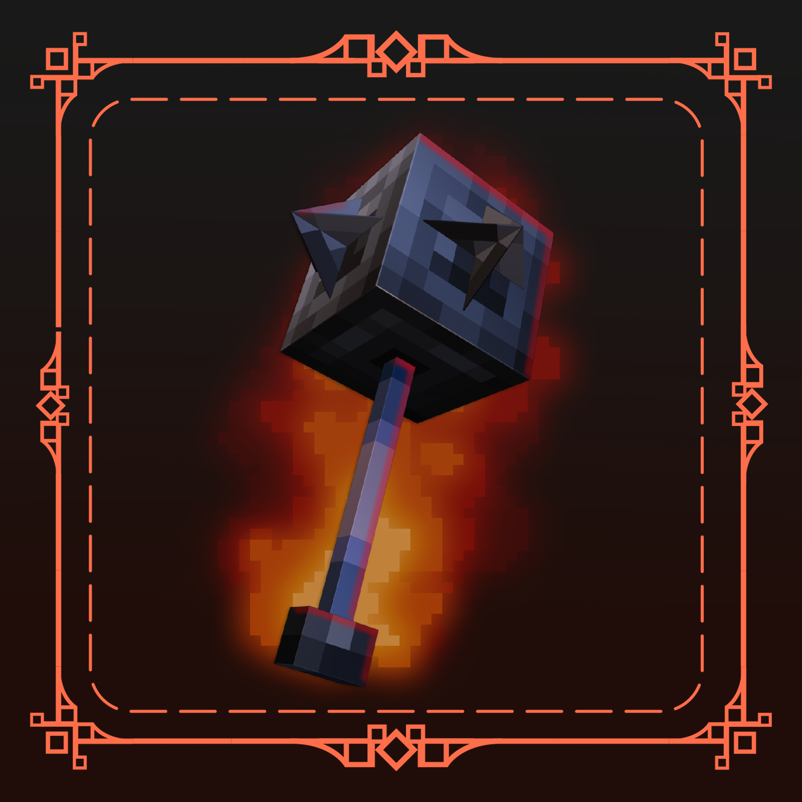

<div align=center>

<br>

<h1>Pommel - Held Item Models</h1></div>

<br>

<h3 align=center>
  <a href="https://modrinth.com/mod/pommel-held-item-models">
  <br>
  Modrinth Page</a>
</h3>

<br>

<h2>What is Pommel?</h2>

<p>Pommel is a Fabric mod that lets resourcepacks replace the models for the held version of items&mdash;just like the spyglass and the trident&mdash;letting you customize what your item looks in your hand. Want to make a 3d model of the mace in your hand, a fiery greatsword, or an ancient magical staff while still retaining the original item? With Pommel, all that can be achieved!</p>
<p>Works for modded items as well!</p>

<br>


<h2>For Resource Pack Creators</h2>

<p>Pommel replaces the held version of an item by a model you specify with the new model item predicate, <code>pommel:is_held</code>. For example, by modifying the model, <code>iron_pickaxe.json</code>, you can tell the mod what model should be displayed when held.</p>

<p>The held model provided as well as the textures for it can be wherever as long as it's specified by the item model json file.</p>


<h3 id="jsonExample">JSON Example:</h3>

```json
{
  "parent": "item/handheld",
  "textures": {
    "layer0": "minecraft:item/2d_model_texture"
  },
  "overrides": [
    { "predicate": { "pommel:is_held": 1.0 }, "model": "minecraft:item/my_held_item" }
  ]
}
```

<p>You may also specify file directories for held models for organizing, as well as changing the parent model to something else.</p>

<br>

<h2>Questions</h2>
<h4>Q: Does this work with CIT [Custom Item Textures]?</h4>
<dl>
    <dd>A: CIT Resewn nor Optifine hasn't updated to 1.21 yet, but I am guessing yes, as long as you have CIT replace the item with a model. CIT lets you replace an item's model, so Pommel should still allow you to have custom held models.</dd>
</dl>

<h4>Q: Does this work with Vanilla Minecraft's item predicates such as Custom Model Data or bow Pulling?</h4>
<dl>
    <dd>A: Yes, but be sure you specify <code>pommel:is_held</code> for the <code>custom_model_data</code> models as well.</dd>
    <br>
    <dd>Here is an example of using vanilla item predicates and held item models:</dd>
    <br>

<dd>

```json
{
  "parent": "item/handheld",
  "textures": {
    "layer0": "item/base_item"
  },
  "overrides": [
    { "predicate": { "pommel:is_held": 1.0 }, "model": "minecraft:item/base_item_held" },
	{ "predicate": { "custom_model_data": 1 }, "model": "minecraft:item/custom_item" },
	{ "predicate": { "custom_model_data": 1, "pommel:is_held": 1.0 }, "model": "minecraft:item/custom_item_held" }
  ]
}
```

</dd>

</dl>

<br>

<h4>Q: How would I replace a modded item's held model?</h4>
<dl>
    <dd>A: Same json hierarchy as in the <a href="#jsonExample">JSON example</a>, but instead of the id <code>minecraft</code> in front, it would be <code>&lt;mod_id&gt</code>.</dd>
</dl>

<h4>Q: I'm having issues getting my held model to work. Where can I go for troubleshooting?</h4>
<dl>
    <dd>A: First check if your JSON code doesn't have errors, as it's pretty easy to accidently screw up JSON code. I use <a href="https://jsonlint.com/">JSONLint</a> for validating my JSON, but most IDEs will also check for errors. If you're still having issues, honestly the best way to get support is to reach out to me on Discord. My username is <i>timmychips</i> so shoot me a message there if you need help!</dd>
</dl>
